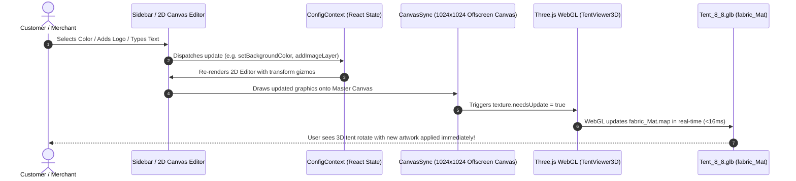

# 🎪 3D Custom Tent Configurator — Codebase Architecture & Flow Guide

This document provides an in-depth breakdown of the entire codebase, the purpose of every file, the data & rendering flow, and a complete guide on how to embed and test this configurator inside a **Shopify Dev Store** with full **Add-to-Cart** functionality.

---

## 📁 1. Project Directory Structure

```text
├── index.html                           # Application entry HTML
├── package.json                         # Project dependencies & build scripts
├── vite.config.js                       # Vite development & bundler configuration
├── Tent_8_8.glb                         # Production 3D GLTF tent model
├── public/                              # Static public assets served directly
│   └── tent-samples/                    # Sample logos (summit, apex, horizon, tech-expo)
└── src/
    ├── main.jsx                         # React DOM mount point
    ├── App.jsx                          # Main container & workspace layout coordinator
    ├── index.css                        # Pure Vanilla CSS design system & component styles
    ├── config/
    │   └── productData.js               # Product metadata, base pricing, default colors & specs
    ├── store/
    │   └── ConfigContext.jsx            # Central React Context state management
    ├── services/
    │   ├── canvasSync.js                # Offscreen Master 2D Canvas & 3D texture synchronizer
    │   ├── pricingService.js            # Real-time dynamic order total & pricing breakdown calculator
    │   └── pdfGenerator.js              # Production 2-page specsheet / print ticket PDF generator
    └── components/
        ├── layout/
        │   ├── Header.jsx               # Top bar with view-mode pills, live pricing, Add to Cart, and PDF export
        │   └── Sidebar.jsx              # Right-hand customization panel tabs (Color, Logos, Text, Layers)
        ├── editor2d/
        │   ├── SurfaceNav.jsx           # Texture info bar above the 2D canvas
        │   └── CanvasEditor2D.jsx       # Interactive HTML5 2D canvas editor (drag, scale, rotate)
        ├── viewer3d/
        │   ├── TentViewer3D.jsx         # WebGL Three.js viewport rendering Tent_8_8.glb
        │   └── ViewportToolbar.jsx      # Camera angle presets, 360° auto-spin, screenshot capture
        └── panels/
            ├── SurfacePanel.jsx         # Fabric background color palette & custom HEX picker
            ├── LogoPanel.jsx            # Logo presets & customer file upload (.PNG / .SVG / .JPG)
            ├── TextPanel.jsx            # Custom typography panel (font, size, stroke, color)
            └── LayersPanel.jsx          # Layer hierarchy manager (reorder, duplicate, delete)
```

---

## 📄 2. File-by-File Explanation

### 🌐 Root Files

| File | Purpose |
| :--- | :--- |
| `index.html` | The single-page HTML entry point with viewport configuration and Google Fonts imports (`Outfit`, `Space Grotesk`, `JetBrains Mono`). Mounts `#root`. |
| `vite.config.js` | Configures Vite dev server on port 3000 with `@vitejs/plugin-react`. |
| `package.json` | Defines dependencies (`react`, `react-dom`, `three`, `jspdf`, `lucide-react`) and scripts (`dev`, `build`, `preview`). |
| `Tent_8_8.glb` | The primary 3D binary glTF model. Contains the canopy tent mesh with the `fabric_Mat` material that receives our live canvas texture. |
| `test.js` | The **Shopify Storefront Bridge Script**. Injected into the Shopify theme to listen for messages from the configurator iframe and trigger `POST /cart/add.js` with all custom artwork files attached. |

---

### 📦 Application Shell (`src/`)

#### [`src/main.jsx`](file:///c:/Users/Lenovo/Downloads/vertical%203d%20assingment/src/main.jsx)
- The React application bootstrap file.
- Renders `<App />` inside `React.StrictMode` into `document.getElementById('root')`.
- Imports `index.css`.

#### [`src/App.jsx`](file:///c:/Users/Lenovo/Downloads/vertical%203d%20assingment/src/App.jsx)
- **Central Coordinator Component**:
  - Wraps the application inside `<ConfigProvider>`.
  - Maintains the invisible `masterCanvasRef` offscreen canvas.
  - Manages the split-screen layout (3D Viewport on the left, 2D Canvas Editor in the middle, Customization Sidebar on the right).
  - Handles the **Screenshot Download**: Captures the current WebGL buffer from Three.js and triggers an instant browser download of `tent_screenshot_<timestamp>.jpg`.
  - Handles the **PDF Export**: Triggers `generateProductionPDF` using snapshots from Three.js and the 2D canvas.

#### [`src/index.css`](file:///c:/Users/Lenovo/Downloads/vertical%203d%20assingment/src/index.css)
- Complete design system written in **Pure Vanilla CSS** (no Tailwind dependency).
- Uses CSS custom properties (`--bg-darkest: #090d16`, `--blue-500: #3b82f6`, glassmorphism styles, responsive flexbox/grid layouts, custom scrollbars, and button micro-animations).

---

### 🗄️ State Management & Data (`src/store/` & `src/config/`)

#### [`src/store/ConfigContext.jsx`](file:///c:/Users/Lenovo/Downloads/vertical%203d%20assingment/src/store/ConfigContext.jsx)
- The single source of truth for the entire application.
- Exposes:
  - `canvasConfig`: `{ backgroundColor: string, layers: Array<Layer> }`.
  - `layers`: Each layer can be an `image` (logo/artwork) or `text` (typography). Contains `x, y, scale, rotation, opacity, color, fontSize`, etc.
  - `activeLayerId`: The currently selected layer for dragging, rotating, or scaling on the 2D canvas.
  - `viewMode`: `'split'` | `'3d'` | `'2d'`.
  - `cameraPreset`: `'front'` | `'iso'` | `'back'` | `'left'` | `'right'` | `'top'`.
  - `autoRotate`: Boolean toggling continuous 360° turntable spin in Three.js.
  - `pricing`: Live recalculated breakdown from `pricingService.js`.
  - Layer mutation helpers: `addTextLayer()`, `addImageLayer()`, `updateLayer()`, `deleteLayer()`, `reorderLayers()`, `setBackgroundColor()`.

#### [`src/config/productData.js`](file:///c:/Users/Lenovo/Downloads/vertical%203d%20assingment/src/config/productData.js)
- Base configuration definitions:
  - `PRODUCT_INFO`: Title, base price ($599.00), dimensions (8ft x 8ft), fabric specs (600D marine-grade polyester, dye-sublimation).
  - `PRESET_COLORS`: High-visibility outdoor event palette (White, Pitch Black, Royal Navy, Cobalt Blue, Crimson Red, Forest Green, Bright Yellow, Safety Orange, etc.).
  - `SAMPLE_LOGOS`: Built-in SVG/PNG sample logos for immediate testing.

---

### ⚙️ Services (`src/services/`)

#### [`src/services/canvasSync.js`](file:///c:/Users/Lenovo/Downloads/vertical%203d%20assingment/src/services/canvasSync.js)
- Manages the offscreen **1024 × 1024 Master Texture Canvas**.
- Function `renderCanvasConfig(ctx, config, width, height)`:
  - Fills the background color.
  - Iterates over all layers in order: translates coordinates, applies rotation, scales, and renders images or text with strokes.
- Ensures the 2D editor and Three.js 3D texture always remain 100% identical.

#### [`src/services/pricingService.js`](file:///c:/Users/Lenovo/Downloads/vertical%203d%20assingment/src/services/pricingService.js)
- Pure business logic function `calculatePricing(config)`.
- Returns `{ subtotal: number, breakdown: Array<{ title, subtitle, amount }> }`.

#### [`src/services/pdfGenerator.js`](file:///c:/Users/Lenovo/Downloads/vertical%203d%20assingment/src/services/pdfGenerator.js)
- Commercial-grade 2-page production specsheet PDF generator using `jsPDF`:
  - **Page 1**: Header banner with unique Design ID, live 3D isometric perspective snapshot of the tent, technical manufacturing specs, base fabric color swatch with HEX code, and an itemized order summary.
  - **Page 2**: High-resolution 2D print layout canvas, list of all applied artwork layers with scale and rotation, and Pre-Press / QC sign-off approval lines.
  - Uses `doc.save(fileName)` directly to avoid blob corruption or premature URL revocation.

---

### 🎨 Components (`src/components/`)

#### 3D Viewport (`src/components/viewer3d/`)
- [`TentViewer3D.jsx`](file:///c:/Users/Lenovo/Downloads/vertical%203d%20assingment/src/components/viewer3d/TentViewer3D.jsx):
  - Initializes Three.js WebGL scene, camera, ambient/directional lighting with soft shadows, and OrbitControls.
  - Loads `/Tent_8_8.glb` using `GLTFLoader`.
  - Traverses the scene to locate the fabric mesh material (`fabric_Mat`).
  - Creates a `THREE.CanvasTexture(masterCanvas)` and assigns it to `fabricMaterial.map` with `flipY = false`.
  - Exposes `captureSnapshot(angle)` and `updateTexture()` to `App.jsx` via `useImperativeHandle`.
- [`ViewportToolbar.jsx`](file:///c:/Users/Lenovo/Downloads/vertical%203d%20assingment/src/components/viewer3d/ViewportToolbar.jsx):
  - Floating pill buttons to jump between camera views (`Front`, `3D Iso`, `Back`, `Left`, `Right`, `Top`).
  - Turntable 360° spin button.
  - Camera snapshot button.

#### 2D Canvas Editor (`src/components/editor2d/`)
- [`CanvasEditor2D.jsx`](file:///c:/Users/Lenovo/Downloads/vertical%203d%20assingment/src/components/editor2d/CanvasEditor2D.jsx):
  - Interactive HTML5 canvas representing the 1024x1024 tent texture.
  - Provides mouse & touch interactions: click to select layer, drag to reposition, resize handles, and rotation handles.
  - Automatically invokes `onCanvasUpdated` whenever a layer changes or moves.
- [`SurfaceNav.jsx`](file:///c:/Users/Lenovo/Downloads/vertical%203d%20assingment/src/components/editor2d/SurfaceNav.jsx):
  - Informational bar displaying texture mapping status (1024x1024 square, active layer count).

#### Sidebar & Customization Panels (`src/components/panels/`)
- [`Sidebar.jsx`](file:///c:/Users/Lenovo/Downloads/vertical%203d%20assingment/src/components/layout/Sidebar.jsx): Tabbed switcher for Color, Logos, Text, and Layers.
- [`SurfacePanel.jsx`](file:///c:/Users/Lenovo/Downloads/vertical%203d%20assingment/src/components/panels/SurfacePanel.jsx): Fabric color palette and custom HEX input.
- [`LogoPanel.jsx`](file:///c:/Users/Lenovo/Downloads/vertical%203d%20assingment/src/components/panels/LogoPanel.jsx): Preset sample logos and custom image file upload.
- [`TextPanel.jsx`](file:///c:/Users/Lenovo/Downloads/vertical%203d%20assingment/src/components/panels/TextPanel.jsx): Text string input, font selection, size slider, stroke outline toggle, and text color picker.
- [`LayersPanel.jsx`](file:///c:/Users/Lenovo/Downloads/vertical%203d%20assingment/src/components/panels/LayersPanel.jsx): Reorder layers (bring forward / send backward), toggle visibility, and delete layers.

---

## 🔄 3. End-to-End Data & Render Flow Diagram



---

## 🛒 4. Brainstorming: How to Test in a Shopify Dev Store

To test this configurator inside your Shopify Development Store and test the **Add-to-Cart** workflow, follow this proven integration architecture:

### 📐 Architecture Overview
```
┌────────────────────────────────────────────────────────┐
│             SHOPIFY PRODUCT PAGE (Liquid)              │
│                                                        │
│  [Product Title: 8x8 Custom Canopy Tent - $599.00]     │
│                                                        │
│  ┌──────────────────────────────────────────────────┐  │
│  │         <iframe> EMBEDDED CONFIGURATOR           │  │
│  │           (Hosted on Vercel)                     │  │
│  │                                                  │  │
│  │   • 3D WebGL Three.js Tent Viewer                │  │
│  │   • 2D Full Texture Editor                       │  │
│  │   • [Add to Cart] Button in Header               │  │
│  └──────────────────────────────────────────────────┘  │
│                           │                            │
│                           ▼ (window.parent.postMessage)│
│  ┌──────────────────────────────────────────────────┐  │
│  │      Single 20-Line Inline Shopify Script        │  │
│  │                                                  │  │
│  │   1. Catches 'CONFIGURATOR_ADD_TO_CART' event    │  │
│  │   2. Converts canvas & snapshots to File Blobs   │  │
│  │   3. Creates FormData with line item properties  │  │
│  │   4. Sends POST to Shopify /cart/add.js          │  │
│  │   5. Redirects to /cart or opens theme drawer!   │  │
│  └──────────────────────────────────────────────────┘  │
└────────────────────────────────────────────────────────┘
```

---

### 🚀 Step-by-Step Testing Guide (Hosting on Vercel)

#### Step 1: Deploy to Vercel
Deploying this project to Vercel takes 1 minute:
1. Push this project to GitHub (or run `npx vercel`).
2. Framework Preset: **Vite**.
3. Build Command: `npm run build`.
4. Output Directory: `dist`.
5. You will get your production URL, e.g. `https://custom-tent-configurator.vercel.app`.

---

#### Step 2: How many scripts are required on Shopify?
**Answer: Exactly 1 single script tag (under 25 lines of code)!**
You do **NOT** need any large scripts, third-party apps, or external dependencies.

In your Shopify Theme (`main-product.liquid` or a custom section):
```html
<!-- 1. The Iframe Embed -->
<div style="width: 100%; margin: 24px 0;">
  <iframe
    id="tent-configurator"
    src="https://custom-tent-configurator.vercel.app"
    style="width: 100%; height: 800px; border: 1px solid #334155; border-radius: 12px;"
    allow="clipboard-write"
  ></iframe>
</div>

<!-- 2. The ONLY script required on Shopify -->
<script>
window.addEventListener("message", async function(event) {
  // Listen for the Add to Cart message from your Vercel configurator
  if (event.data && event.data.type === "CONFIGURATOR_ADD_TO_CART") {
    const data = event.data;

    // Convert high-res print texture and 3D preview to File Blobs
    const textureBlob = await (await fetch(data.textureData)).blob();
    const snapshotBlob = await (await fetch(data.snapshotData)).blob();

    // Prepare Shopify Line Item Properties
    const formData = new FormData();
    formData.append("id", {{ product.selected_or_first_available_variant.id }});
    formData.append("quantity", "1");
    formData.append("properties[Design ID]", data.designId);
    formData.append("properties[Base Color]", data.color);
    formData.append("properties[Print Layout Texture]", textureBlob, "print_layout_" + data.designId + ".png");
    formData.append("properties[3D Isometric Preview]", snapshotBlob, "preview_3d_" + data.designId + ".jpg");

    // Add directly to Shopify Cart
    try {
      const response = await fetch(window.Shopify.routes.root + "cart/add.js", {
        method: "POST",
        body: formData
      });
      const item = await response.json();
      console.log("Custom tent added to Shopify cart:", item);

      // Open cart or redirect
      window.location.href = "/cart";
    } catch (err) {
      console.error("Shopify cart add error:", err);
    }
  }
});
</script>
```

---

---

#### Step 3: What the Merchant Sees in Shopify Admin
When an order is placed through this flow:
1. In Shopify Admin under **Orders** -> Open the new order.
2. The Line Item will show:
   - **Product**: 8x8 Custom Logo Canopy Tent
   - **Line Item Properties**:
     - `Design ID`: `TENT-8X8-XXXXXX`
     - `Base Color`: `#FFFFFF`
     - `Print Layout Texture`: Clickable download link directly to the high-res 1024x1024 print layout PNG!
     - `3D Isometric Preview`: Clickable download link directly to the 3D snapshot JPG!
3. The print production team can immediately download the full print layout file and send it to the dye-sublimation printer!

